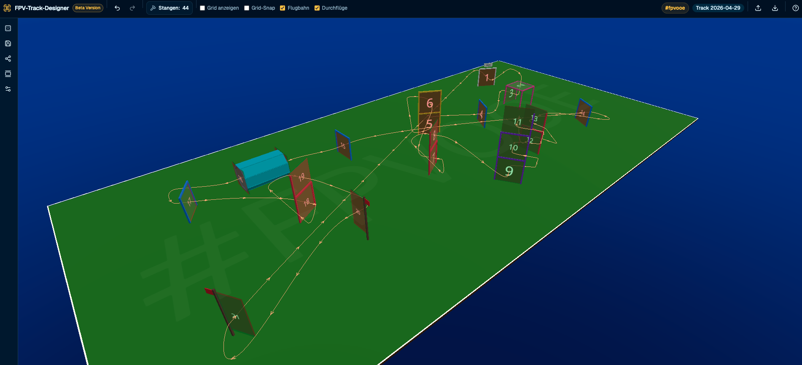

# FPV Track Designer

Ein desktop-orientierter 3D-Editor zum Entwerfen, Generieren und Speichern von FPV-Drohnen-Rennstrecken direkt im Browser.

Das Projekt kombiniert eine interaktive React-Oberfläche mit einer Three.js/R3F-Szene. Strecken können automatisch generiert, über einzelne Gates feinjustiert und lokal als JSON-ähnliche Track-Daten gespeichert werden.



## Features

- **3D-Streckeneditor** mit frei sichtbarer FPV-Rennstrecke
- **Zufällige Track-Generierung** anhand von Feldgröße, Gate-Anzahl und Gate-Größe
- **8 Gate-Typen**: Standard, Start/Ziel, H-Gate, Double-H, Dive, Double, Ladder und Flag
- **Gate-Bearbeitung** direkt in der Szene: auswählen, verschieben, drehen, einfügen und löschen
- **Flugpfad-Visualisierung** mit Gate-Reihenfolge und Richtungspfeilen
- **Undo/Redo-Verlauf** für Bearbeitungsschritte
- **Lokale Speicherung** von Tracks im Browser über `localStorage`
- **Track-Galerie** zum Laden und Löschen gespeicherter Strecken
- **Keyboard-Shortcuts** für schnelle Bedienung

## Tech Stack

- [React](https://react.dev/) 19
- [TypeScript](https://www.typescriptlang.org/)
- [Vite](https://vite.dev/)
- [React Three Fiber](https://r3f.docs.pmnd.rs/) und [Drei](https://github.com/pmndrs/drei)
- [Zustand](https://zustand-demo.pmnd.rs/) für globalen State
- [Tailwind CSS](https://tailwindcss.com/) v4
- [shadcn/ui](https://ui.shadcn.com/) Komponenten
- [Vitest](https://vitest.dev/) für Tests

## Voraussetzungen

- Node.js 20 oder neuer empfohlen
- npm

## Installation

```bash
git clone <repository-url>
cd fpv-track-designer
npm install
```

## Entwicklung starten

```bash
npm run dev
```

Die App läuft anschließend standardmäßig unter:

```text
http://localhost:5173
```

## Nützliche Skripte

```bash
npm run dev      # Entwicklungsserver starten
npm run build    # TypeScript prüfen und Produktions-Build erstellen
npm run preview  # Produktions-Build lokal ansehen
npm run lint     # ESLint ausführen
npm run test     # Vitest starten
```

## Bedienung

### Strecke konfigurieren

Über die Einstellungen können Gate-Anzahlen, Feldmaße, Gate-Größe sowie Anzeigeoptionen angepasst werden. Beim Mischen wird daraus automatisch eine neue Strecke erzeugt.

### Gates bearbeiten

1. Gate in der 3D-Szene anklicken.
2. Verschieben- oder Drehen-Werkzeug direkt am Gate verwenden.
3. Neue Gates können relativ zu einem ausgewählten Gate eingefügt werden.
4. Ausgewählte Gates lassen sich per Dialog oder Shortcut löschen.

### Maussteuerung in der 3D-Ansicht

Die Ansicht kann vollständig mit der Maus bedient werden:

| Aktion | Mausbedienung |
| --- | --- |
| Ansicht drehen | Linke Maustaste gedrückt halten und ziehen |
| Über die Strecke bewegen | Rechte Maustaste gedrückt halten und ziehen (draggen/pannen) |
| Zoomen | Mausrad scrollen oder Mausrad/mittlere Maustaste gedrückt halten und nach oben/unten ziehen |
| Kamerahöhe ändern | `Shift` gedrückt halten und mit linker Maustaste ziehen |

Alternativ kann die Ansicht auch mit `Space + linke Maustaste ziehen` verschoben werden.

### Shortcuts

| Aktion | Shortcut |
| --- | --- |
| Strecke shuffeln | `S` |
| Strecke speichern | `Cmd/Ctrl + S` |
| Galerie öffnen | `G` |
| Ansicht verschieben | `Space + linke Maustaste ziehen` |
| Kamerahöhe ändern | `Shift + linke Maustaste ziehen` |
| Auswahl/Dialog schließen | `Escape` |
| Ausgewähltes Gate löschen | `Backspace` |
| Rückgängig | `Cmd/Ctrl + Z` |
| Wiederholen | `Cmd/Ctrl + Y` oder `Cmd/Ctrl + Shift + Z` |

## Projektstruktur

```text
src/
├── components/
│   ├── gates/       # 3D-Komponenten für Gate-Typen und Handles
│   ├── layout/      # TopBar und Werkzeugleiste
│   ├── scene/       # R3F-Canvas, Kamera, Grid und Flugpfad
│   └── ui/          # Dialoge, Panels und shadcn/ui-Primitives
├── hooks/           # Keyboard- und Auswahl-Logik
├── schemas/         # Zod-Validierung für Track-Daten
├── store/           # Zustand-Slices für Config und Tracks
├── types/           # TypeScript-Domänenmodelle
└── utils/           # Generator, Flugpfad, Gate-Operationen und Storage
```

## Daten und Speicherung

Die App benötigt kein Backend. Gespeicherte Tracks werden lokal im Browser abgelegt. Dadurch bleiben Daten auf dem Gerät, sind aber auch an den jeweiligen Browser und dessen Speicher gekoppelt.

## Tests

Die Kernlogik ist mit Vitest abgedeckt, unter anderem für:

- Track-Generierung
- Gate-Operationen
- Gate-Öffnungen und Sequenzen
- Flugpfad-Berechnung
- Store-Slices
- LocalStorage-Persistenz

```bash
npm run test
```

## Build

```bash
npm run build
```

Der Build führt zuerst den TypeScript-Projektcheck aus und erstellt danach die optimierten Vite-Assets in `dist/`.

## Lizenz

Falls du das Projekt veröffentlichst, ergänze hier noch die gewünschte Lizenz, zum Beispiel MIT.
